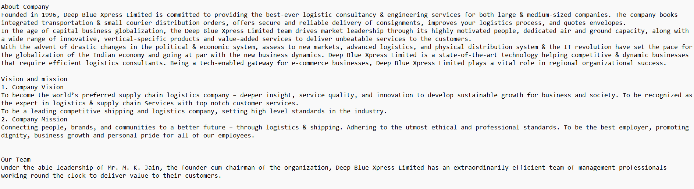
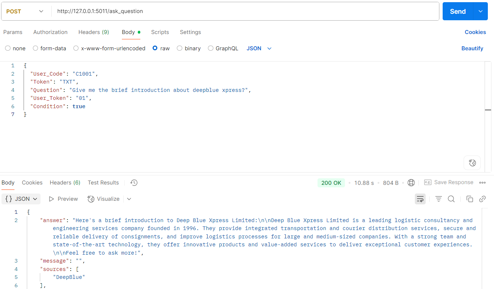
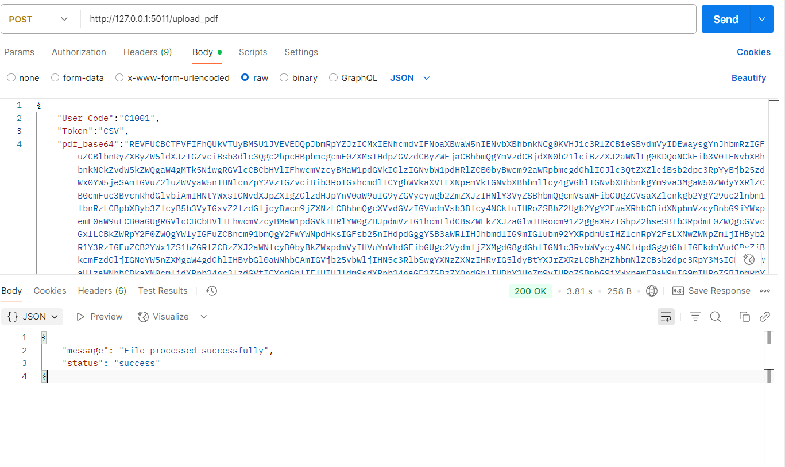
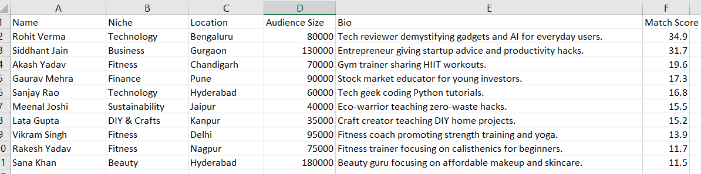
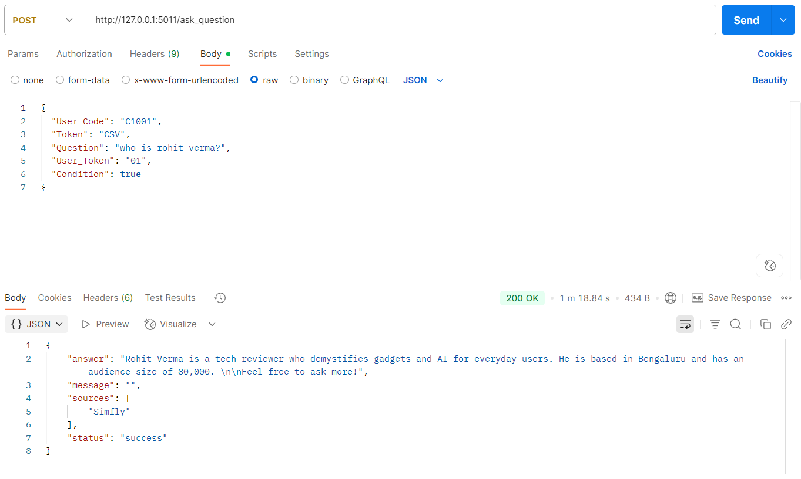

# RAG-Based Question Answering Chatbot (Dockerized Deployment)

This project implements a Retrieval-Augmented Generation (RAG)-based Question Answering chatbot using OCR (PaddleOCR), Flask API, and Dockerized deployment.

---

## Features

Supports ingestion of multiple document formats: PDF, DOCX, XLSX, CSV, and TXT.

Extracts text from both file content and embedded images (using OCR for images inside PDFs).

Converts extracted data into searchable vector embeddings using FAISS.

Stores vectorized data for efficient semantic search and question answering.

REST API exposed via Flask for document upload and processing.

Fully containerized and deployable using Docker.

---

## Setup Instructions

### Clone the repository
git clone https://github.com/Akash8787/RAG-Based-Question-Answering-Chatbot-with-Containerized-Deployment.git

cd RAG-Based-Question-Answering-Chatbot-with-Containerized-Deployment

pip install -r requirements.txt

## Docker Setup ===>
# Build Docker Image
Inside the project directory
run: 
docker build -t dockerimage .

Once docker image is created then Run Docker Container

docker run -p 5011:5011 dockerimage

You can give the port according to you.

# API Endpoints

# Upload
/upload_pdf                 -Upload and Ingest Document

method- POST

Parameters:

{
    "User_Code":"",
    "Token":"",
    "pdf_base64":"",
    "filename":"",
    "file_extension":""
}

example of upload endpoint:
you can pass each parameter according to you it's not hardcoded.

{
    "User_Code":"C1001",  
    "Token":"TXT",
    "pdf_base64":"",
    "filename":"Fitness",
    "file_extension":".pdf"
}

# Ask Question
/ask_question   — Ask Questions

method- POST

{
  "User_Code": "",
  "Token": "",
  "Question": "",
  "User_Token": "",
  "Condition":  
}

example of ask question endpoint:
you can pass each parameter according to you it's not hardcoded.

{
  "User_Code": "C1001",
  "Token": "TXT",
  "Question": "Hi",
  "User_Token": "01",
  "Condition": true 
}

User_Token used to maintain user-specific session history separately. This allows the system to handle multiple users and keep their conversation context isolated.

A condition is provided to control the LLM's response behavior.

If the condition is set to true, the LLM will strictly respond only based on the content extracted from the provided document.

If the condition is set to false, the LLM will first try to respond using the extracted document content; if the required information is not found, it will then generate a response based on its own knowledge.

## API Request Example for Txt file

## API Request Example for CSV file

